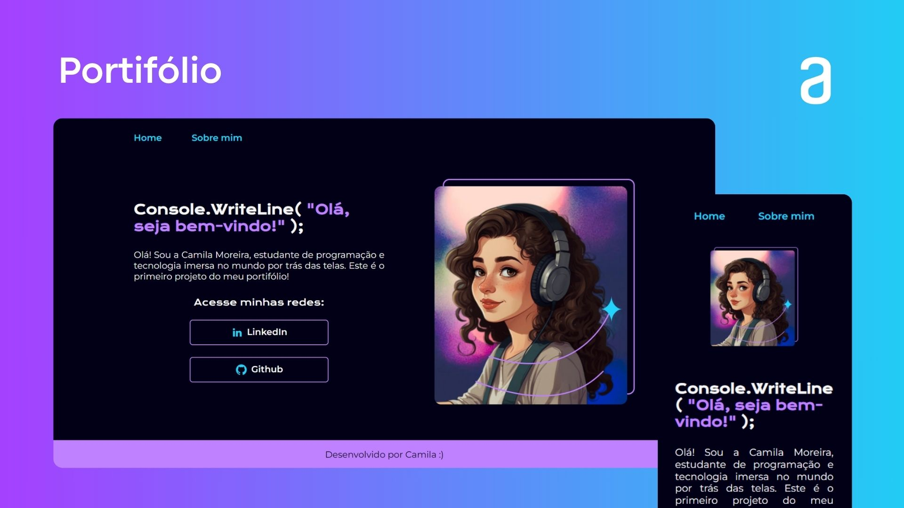

# Portifólio 🫧

### Olá, seja bem-vindo ao meu primeiro portifólio! 

Este é um projeto simples de portfólio pessoal, cujo objetivo é criar uma página estática para exibir informações e textos como uma apresentação pessoal.

## 🛠️ Ferramentas utilizadas:

- HTML
- CSS

## 🔗 Deploy:

Para acessar o site, [clique aqui.](https://portifolio-seven-drab.vercel.app/)

## 👩🏻‍💻 Desenvolvido por:

### Camila Moreira

LinkedIn: https://www.linkedin.com/in/camila-moreira-dev/

## 

Este projeto foi desenvolvido com os cursos de HTML e CSS da [Alura](https://www.alura.com.br/) 🤿